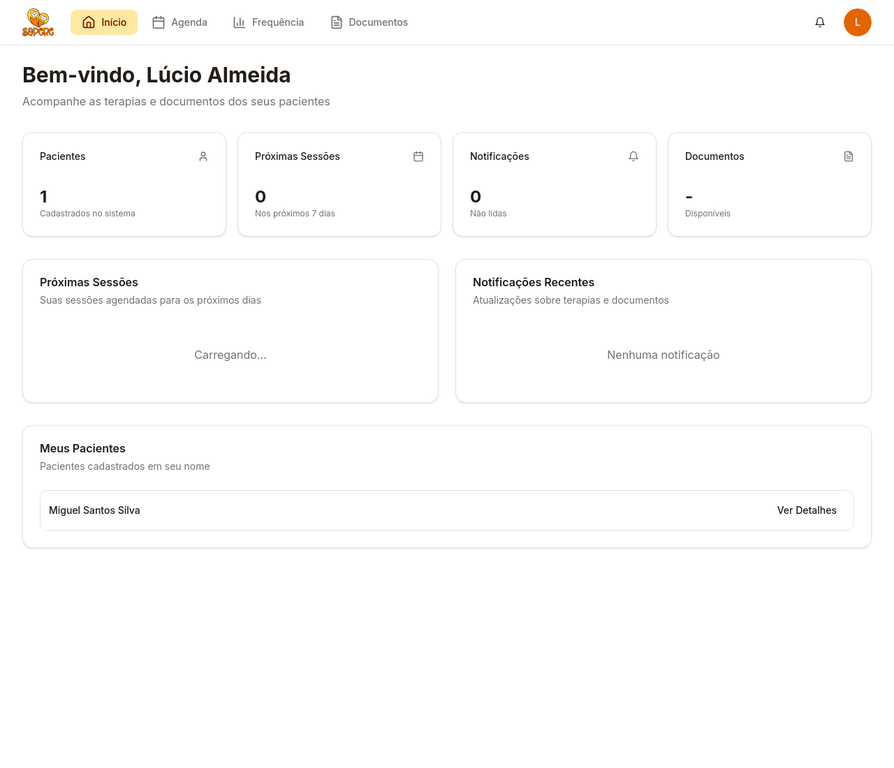
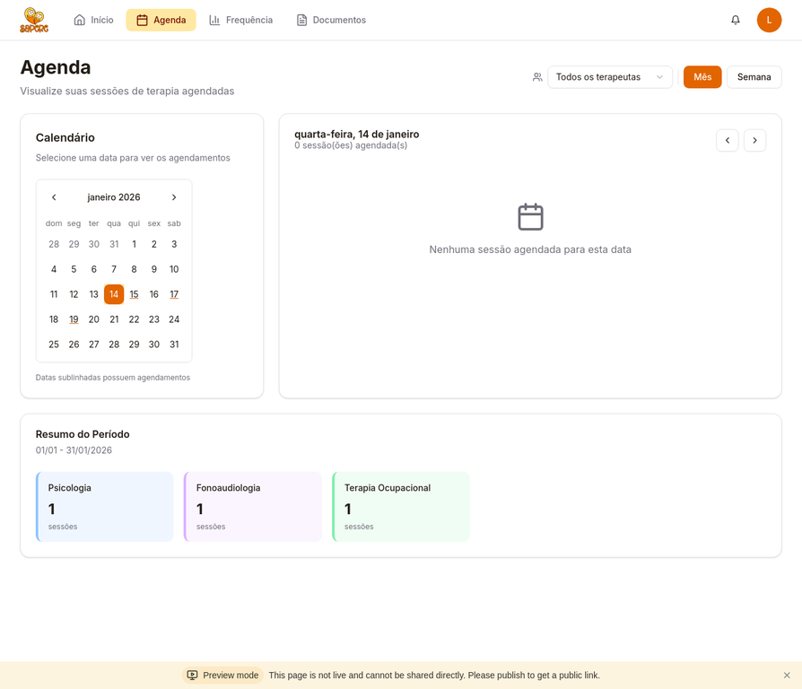
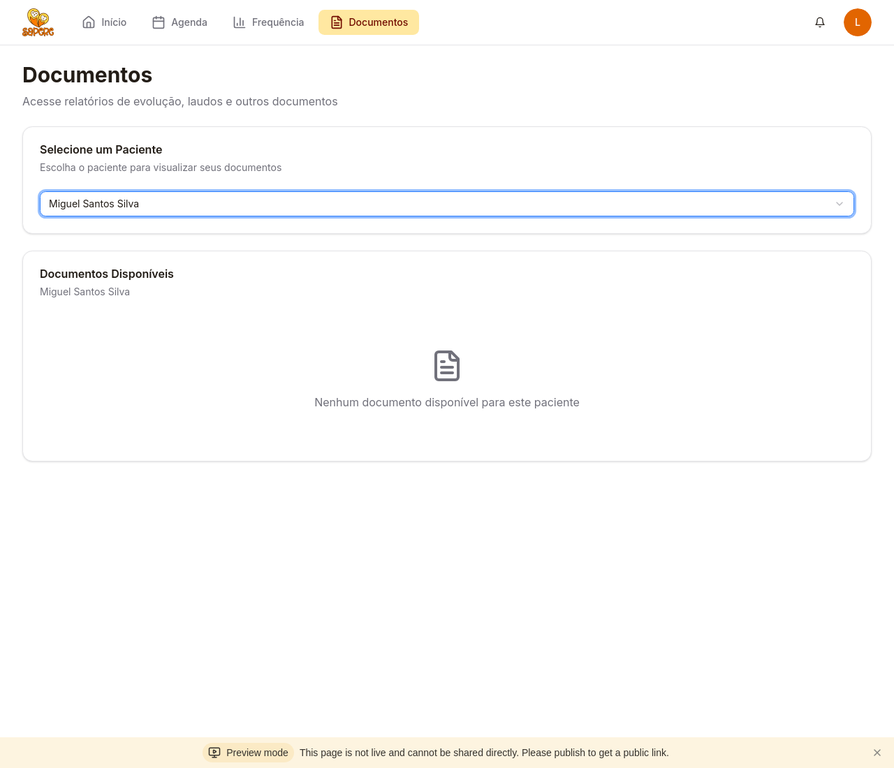
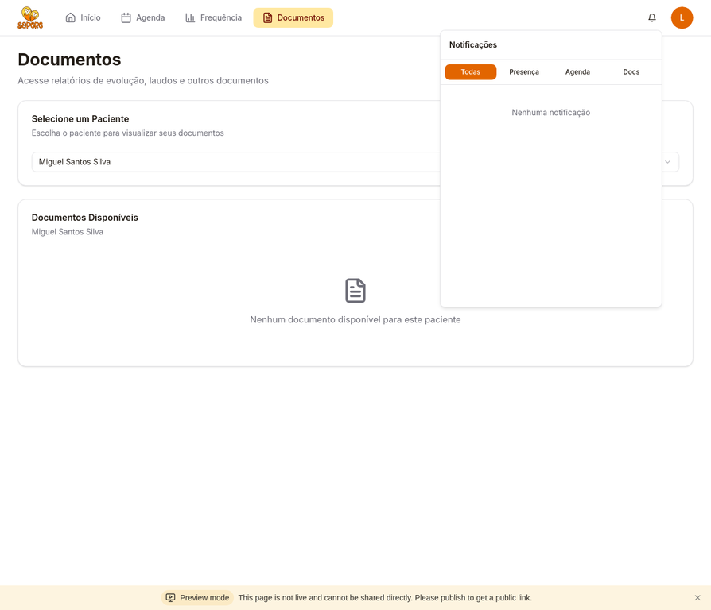

# Guia de Uso do App Sapere
## Para Pais e Responsáveis

Bem-vindo ao App Sapere! Este guia vai ajudar você a acompanhar o desenvolvimento do seu filho de forma simples e prática. Aqui você encontra tudo o que precisa saber para usar o aplicativo no dia a dia.

---

## Como Acessar o App

Você pode acessar o App Sapere pelo navegador do seu celular ou computador. Basta entrar no link que a clínica enviou para você e fazer login com seu email e senha.

**Dica:** Salve o link nos favoritos do seu celular para acessar mais rápido sempre que precisar.

---

## Tela Inicial

Quando você entra no app, a primeira tela mostra um resumo rápido de tudo o que está acontecendo: próximas sessões, frequência recente e atalhos para as principais funções.

Aqui você vê de forma rápida o que está por vir e pode acessar qualquer área do app com um toque.

---

## Agenda

Na agenda, você visualiza todas as sessões de terapia agendadas para o seu filho. O calendário mostra os dias com sessões marcadas, e você pode clicar em qualquer data para ver os detalhes: horário, terapeuta e tipo de terapia.

É uma forma prática de se organizar e não perder nenhuma sessão. Você também pode ver um resumo do mês com a quantidade de sessões por tipo de terapia.

---

## Documentos

Na seção de documentos, você encontra todos os relatórios de evolução, laudos e outros arquivos importantes sobre o acompanhamento do seu filho. Basta selecionar o nome do seu filho no menu e todos os documentos disponíveis aparecem para você visualizar ou baixar.

Sempre que um novo documento for enviado pela equipe, você recebe uma notificação e pode acessá-lo aqui.

---

## Notificações

O sininho no canto superior direito mostra as notificações importantes: novos documentos, alterações de horário ou lembretes de sessões. Clique nele para ver todas as mensagens e marcar como lidas.

Você pode filtrar as notificações por tipo (presença, agenda, documentos) para encontrar o que procura mais rápido.

---

## Dúvidas e Suporte

Se tiver qualquer dúvida sobre como usar o app ou precisar de ajuda, a equipe da Sapere está à disposição. Entre em contato com a recepção pelo telefone ou pessoalmente. Estamos aqui para tornar essa jornada mais leve e acolhedora para você e sua família.
